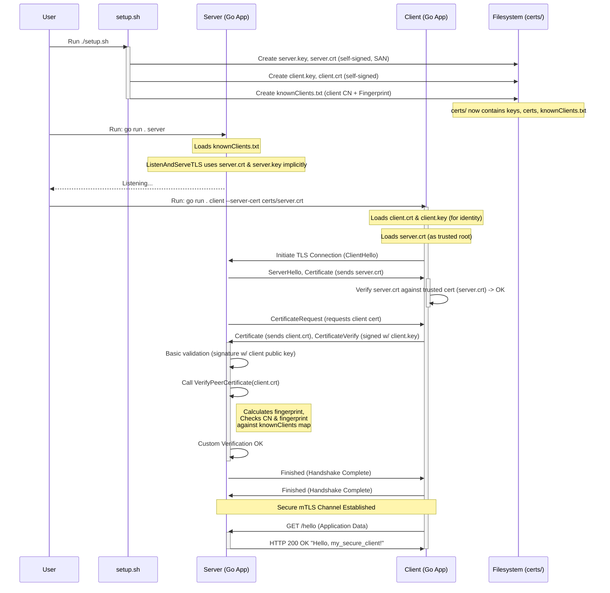

# Go mTLS Playground with Self-Signed Certs & Known Clients Auth

This playground demonstrates mutual TLS (mTLS) authentication between a Go client and server using **self-signed certificates**.

- The client explicitly trusts the server's specific self-signed certificate.
- The server authorizes the client based on a `knownClients.txt` file containing the client certificate's Common Name (CN) and SHA-256 fingerprint.

This model avoids a shared Certificate Authority (CA), providing strong isolation between server/client pairs.

It is implemented as a single CLI application with `server` and `client` subcommands.

## Structure

```
tls-playground/
├── certs/              # Generated self-signed certificates and keys (after running ./setup.sh)
│   ├── server.crt        # Server's self-signed certificate
│   ├── server.key        # Server's private key
│   ├── client.crt        # Client's self-signed certificate
│   ├── client.key        # Client's private key
│   └── knownClients.txt  # File listing the authorized client CN and fingerprint
├── client.go           # Go TLS client implementation (Client struct)
├── go.mod              # Go module definition
├── go.sum              # Go module checksums
├── main.go             # Main CLI entrypoint (using kong)
├── main_test.go        # Integration test
├── server.go           # Go TLS server implementation (Server struct)
├── setup.sh            # Script to generate self-signed certs and knownClients.txt
├── tlsconfig.go        # Helper functions for creating TLS configurations
└── README.md           # This file
```

## Setup

1.  **Ensure `openssl` is installed.** This script relies on `openssl` for certificate generation.
2.  **Fetch Go dependencies:**
    ```bash
    go mod tidy
    ```
3.  **Make the setup script executable:**
    ```bash
    chmod +x setup.sh
    ```
4.  **Run the setup script:**
    ```bash
    ./setup.sh
    ```
    This will:
    - Create a `certs` directory.
    - Generate a self-signed server certificate (`server.crt` with SAN) and key (`server.key`).
    - Generate a self-signed client certificate (`client.crt`) and key (`client.key`).
    - Create a `knownClients.txt` file listing the client's CN and SHA-256 fingerprint.

## Running

The application is a single binary with subcommands.

1.  **Start the Server:**
    Open a terminal and run:

    ```bash
    go run . server
    # Or with custom options:
    # go run . server --addr :9000 --known-clients certs/otherClients.txt --cert certs/otherServer.crt --key certs/otherServer.key
    ```

    The server will start listening (default: `https://localhost:8443`). It requires clients to present a certificate and validates them against the specified known clients file (default: `certs/knownClients.txt`). Press `Ctrl+C` to stop.

2.  **Run the Client:**
    Open another terminal and run:
    ```bash
    go run . client
    # Or with custom options:
    # go run . client --url https://otherhost:9000/hello --server-cert certs/otherServer.crt --cert certs/otherClient.crt --key certs/otherClient.key
    ```
    The client will connect to the server, presenting its certificate (`client.crt`) and verifying the server against the _specific_ server certificate provided (`--server-cert`, defaults to `certs/server.crt`). If authentication succeeds on both ends and the client is authorized by the server, you will see the server's response printed.

## Testing

An integration test is included (`main_test.go`) that starts the server, runs the client against it (using the specific server cert for trust), and verifies the connection.

Ensure you have completed the **Setup** steps first (especially `./setup.sh`).

Run the test using:

```bash
go test -v .
```

## How it Works

1.  **CLI (`main.go`)**: Uses the `kong` library to parse command-line arguments and flags for the `server` and `client` subcommands.
2.  **TLS Configuration (`tlsconfig.go`)**: Contains helper functions (`createServerTLSConfig`, `createClientTLSConfig`) to generate the necessary `*tls.Config` objects.
3.  **Server (`server.go`)**: Defines a `Server` struct. Its `Start` method configures TLS (using `createServerTLSConfig`) to require _any_ client certificate (`tls.RequireAnyClientCert`) but relies solely on the custom `VerifyPeerCertificate` function for authorization. `loadKnownClients` and `verifyClientCertificate` implement the authorization check based on the known clients file (CN and fingerprint match).
4.  **Client (`client.go`)**: Defines a `Client` struct. Its `NewClient` function configures the client's TLS (using `createClientTLSConfig`) to present its own cert/key and explicitly trust the specific server certificate loaded into the `RootCAs` pool (via the `--server-cert` flag).
5.  **mTLS Handshake**:
    - Client connects and receives the server's self-signed certificate (`server.crt`).
    - Client checks if `server.crt` is present in its explicitly configured `RootCAs` pool (loaded from the `--server-cert` file). If yes, server identity is verified.
    - Server requests the client's certificate.
    - Client presents its self-signed certificate (`client.crt`) and proves possession of the corresponding private key.
    - Server receives `client.crt`.
    - Server's `VerifyPeerCertificate` function runs: It calculates the fingerprint of `client.crt`, looks up the CN in `knownClients.txt`, and verifies the fingerprint matches. If yes, the client is authorized, and the handshake completes.

## Interaction Diagram



## Experimenting

- **Modify `certs/knownClients.txt`:** Change the fingerprint or CN -> Client connection should fail authorization on the server (run `go run . client`).
- **Run Client with wrong client cert:** `go run . client --cert certs/server.crt --key certs/server.key` -> Should fail authorization on the server.
- **Run Client trusting wrong server cert:** `go run . client --server-cert certs/client.crt` -> Should fail the handshake because the cert presented by the server (`server.crt`) won't be trusted by the client.
- **Modify `server.go`:** Change `ClientAuth` in `createServerTLSConfig` (e.g., to `tls.NoClientCert`) to see how server requirements change.
- **Review `main_test.go`:** See how the server and client components are used programmatically.
